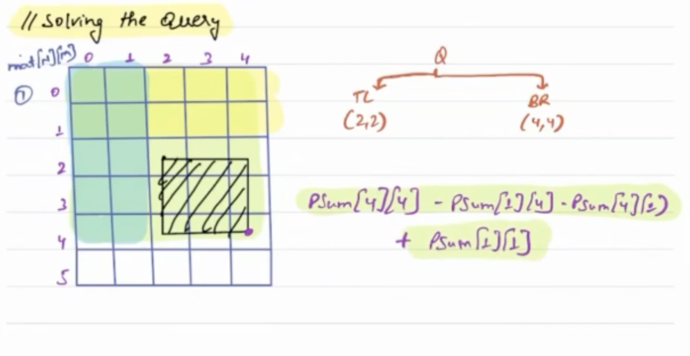

First, we need to compute prefixSumMatrix[N][M] of same dimensions as the given 2D array. Also, choose the data type of
prefixSumMatrix[][] carefully, as the sum of elements can be very large.

Once the prefixSumMatrix[][] is computed, for each query, you can calculate the sum of the submatrix in constant time by
subtracting the appropriate prefix sums. Specifically, to find the sum of the submatrix from (b,c) to (d,e), you can use
the following formula:

sum = prefixSumMatrix[d][e] - prefixSumMatrix[d][c-1] - prefixSumMatrix[b-1][e] + prefixSumMatrix[b-1][c-1]

This formula subtracts the prefix sums of the regions that should not be included in the submatrix, and adds back the
prefix sum of the overlap region.

Finally, you can return the answer mod 1000000007 to ensure that it fits within the given constraints.

    TC: O(N*M)
    SC: O(N*M)