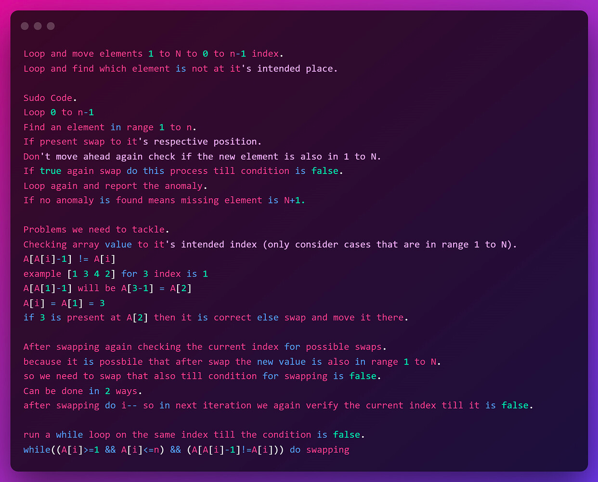
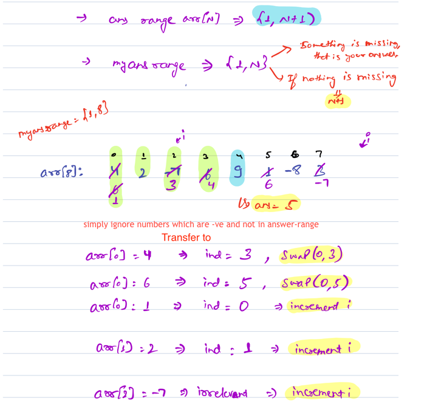

**Approach:**

The idea is to sort the in range natural numbers [1,n] to their correct position in 0 based indexing. Then check the
array/arraylist which does not match the position. The natural number which does not match the position is the answer.
If all the elements are in correct position then the max + 1 is The answer.

    TC : O(N)
    SC : O(1)

