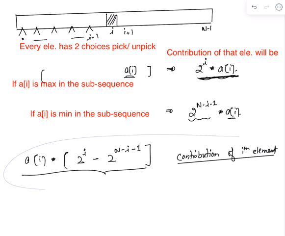

After sorting the array, for every element,
number of subsets where arr[i] is the smallest element = 2^i
number of subsets where arr[i] is the largest element = 2^(N-i-1)

So, contribution of arr[i] in our ans = arr[i] * (2^(N-i-1) - 2^i)

But, be careful, these values can be really large -

2^(N-i-1) : To calculate this you need to take modulo at every step of multiplication

2^i : To calculate this you need to take modulo at every step of multiplication

    TC: O(NlogN)
    SC: O(1)