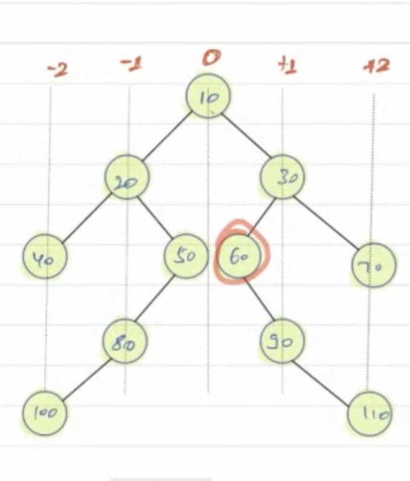

**Approach**

1) For the left subtree, we pass the Horizontal Distance as the Horizontal distance of root minus 1.
2) For the right subtree, we pass the Horizontal Distance as the Horizontal Distance of root plus 1.

3) For every HD value, we maintain a list of nodes in a hasp map. 
4) Whenever we see a node in traversal, we go to the hash map entry and add the node to the hash map using HD as a key in a map.

    TC: O(N)
    SC: O(N)