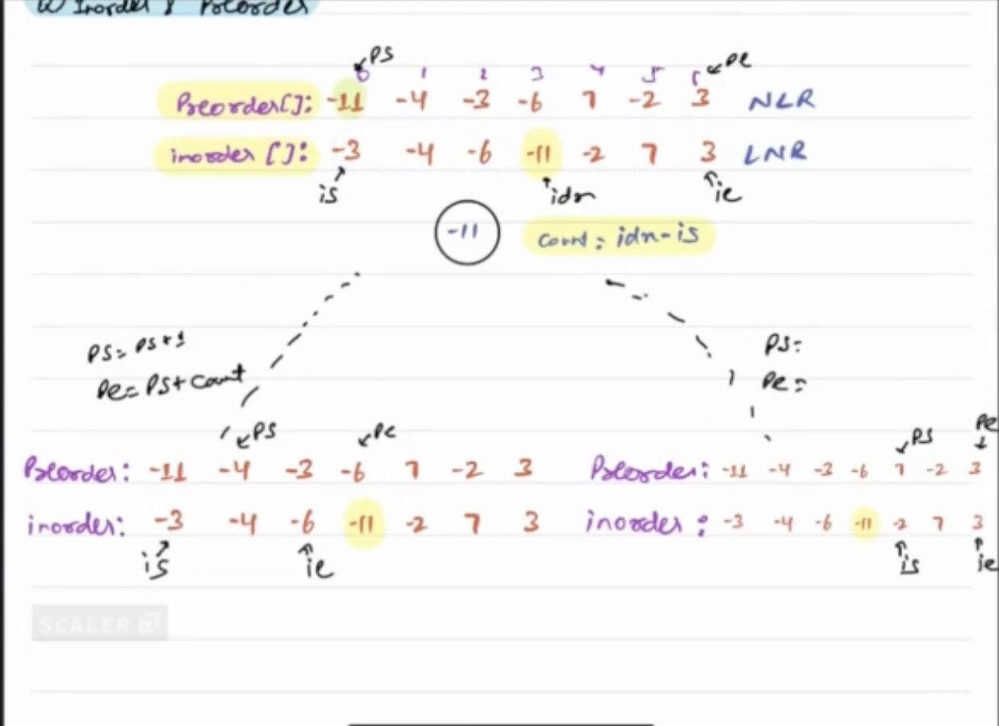

**Approach**
1) Focus on the preorder traversal to begin with. 

2) The first element in the traversal will definitely be the root. 

3) Based on this information, you identify the elements in the left subtree
and right subtree

    TC: O(N)
    SC: O(H), H is height of Tree