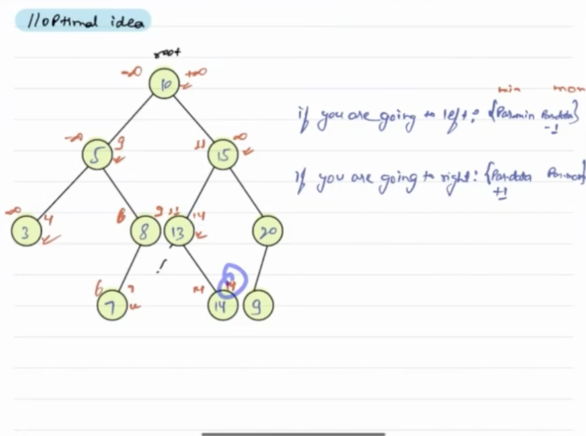

**Approach**
1) Traverse the tree using recursion and check if every node is satisfying the condition for BST or not.
2) For this, initialize min and max with -infinity and +infinity respectively.
3) Start with root node and check if it is lying in the range (min, max), and update min and max.

4) Now, check for left and right subtree recursively.

5) Left child value should lie between (min, value of node) and right child value should lie between (value of node, max).

In this, we are traversing each node only once. So, the time complexity is O(n).

    TC: O(N)
    SC: O(H), H = height of tree