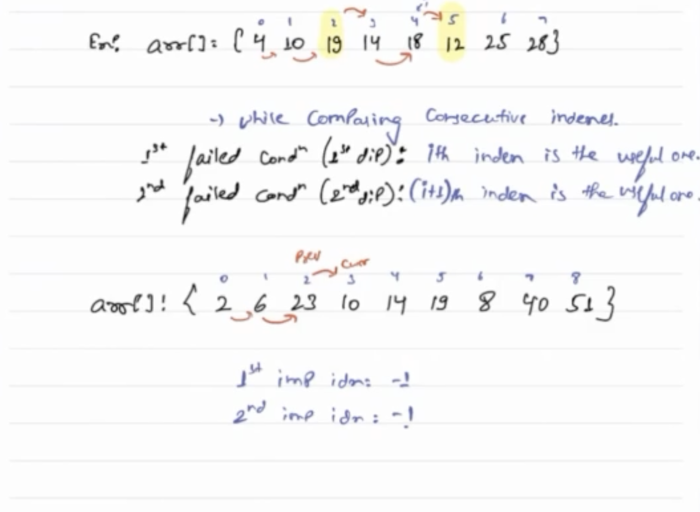

Let’s look at the inorder traversal of the tree.

In the ideal case, the inorder traversal should be sorted.
But in this case, because of the swapping 2 cases might arise :
So while traversing in INOrder fashion 
we will check for prev and curr element for each time.

    TC: O(N)
    SC: O(H)

**Morris traversal** 

helps us achieve what we are after. It works on the fact that we can modify the tree when traversing and then resetting the tree to its original state once we are done.
The idea of Morris traversal is based on the Threaded Binary tree ( http://en.wikipedia.org/wiki/Threaded_binary_tree ).
In this traversal, we first create links to Inorder successor and print the data using these links, and finally revert the changes to restore the original tree.

On the current recursion,

Check if the root is less than the previous value.
Then update the 2 variables accordingly.
If the first variable is None, update it with the current value.
Then update the second variable with the currrent value.
After the traversal, return the first and second variable.

    TC: O(N)
    SC: O(1)