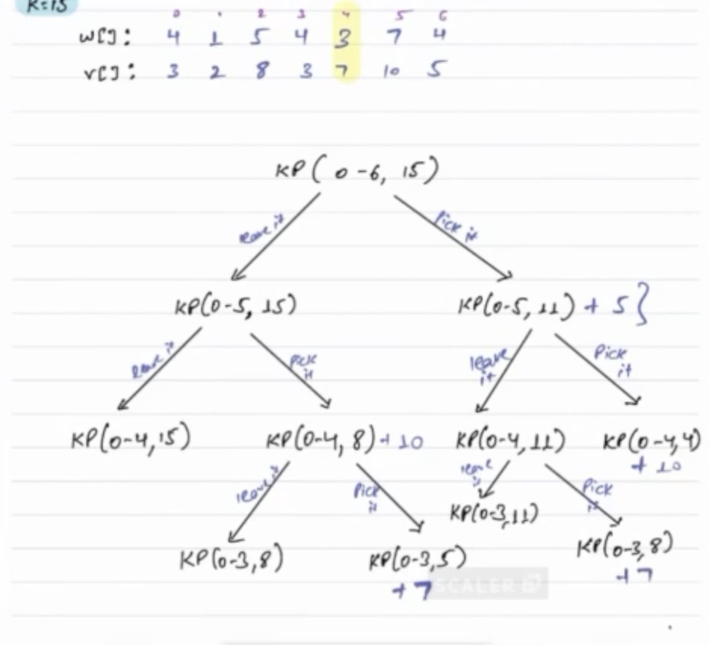

**Approach**

1) We have to check for all subsequences in the weight array
2) For that there will be 2 options pick and unpick
3) if we pick then from knapsack K weight to current weight will be deducted as K -w[i]
4) And for that its corresponding value v[i] will be added to it.
5) If we are not picking this item then we have to calculate for rest of the item.

    
    TC: O(N*K), K is the Knapsack capacity
    SC: O(N*K)