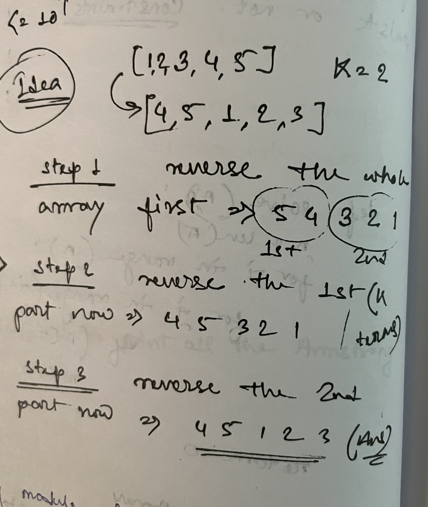

Let n be the length of the array.
Rotating an array by n and 2 * n times gives the same results, i.e., rotating i or i % n times is the same.
So, we update B to B % n.

When we rotate the array B times, B elements from the back end of the array come to the front 
and the rest of the elements from the front shift backward.

In this approach, we firstly reverse all the elements of the array. 
Then, reversing the first B elements followed by reversing the rest N - B elements gives us the required result.

    TC : O(N)
    SC : O(1)