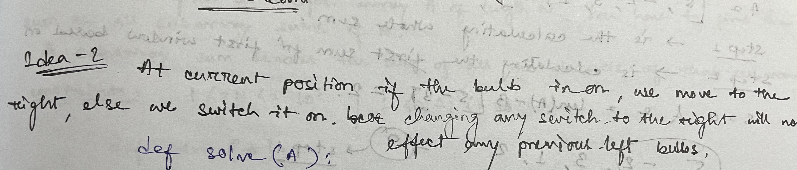

The order in which you press the switch does not affect the final state.

Example:

Input : [0 1 0 1]

Case 1:
    Press switch 0 : [1 0 1 0]
    Press switch 1 : [1 1 0 1]

Case 2:
    Press switch 1 : [0 0 1 0]
    Press switch 0 : [1 1 0 1]  
Therefore we can choose a particular order. To make things easier, let’s go from left to right. At the current position, if the bulb is on, we move to the right, else we switch it on. This works because changing any switch to the right of it will not affect it anymore.

Idea-1

    TC: O(N)
    SC: O(1)

Idea-2

    TC: O(N)
    SC: O(1)