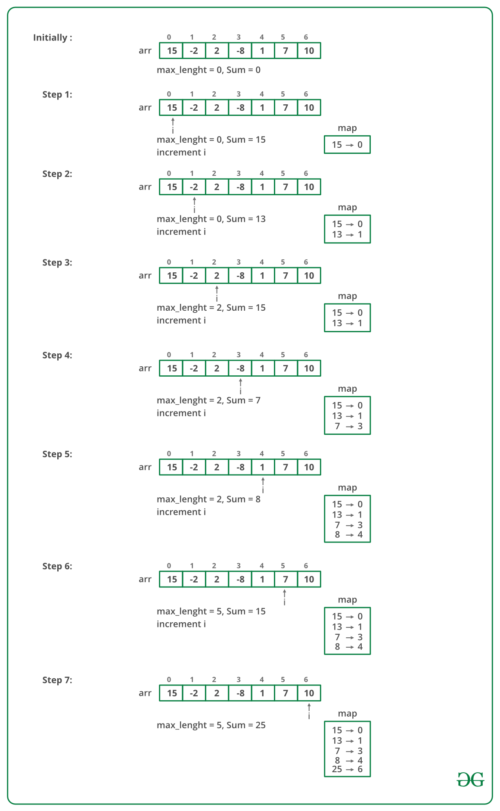

Let us say prefixsum of array till index i is represented as Si .
Now consider two indices i and j (j > i) such that Si = Sj .

So, 
Si = arr[0] + arr[1] + . . . + arr[i]
Sj = arr[0] + arr[1] + . . . + arr[i] + arr[i+1] + . . . + arr[j]

Now if we subtract Si from Sj .
Sj – Si = (arr[0] + arr[1] + . . . + arr[i] + arr[i+1] + . . . + arr[j]) – (arr[0] + arr[1] + . . . + arr[i])
0 = (arr[0] – arr[0]) + (arr[1] – arr[1]) + . . . + (arr[i] – arr[i]) + arr[i+1] + arr[i+2] + . . . + arr[j]
0 = arr[i+1] + arr[i+2] + . . . + arr[j]

So we can see if there are two indices i and j (j > i) for which the prefix sum are same then the subarray from i+1 to j has sum = 0.

We can use hashmap to store the prefix sum, and if we reach any index for which there is already a prefix with same sum, we will find a subarray with sum as 0. 
Compare the length of that subarray with the current longest subarray and update the maximum value accordingly.

**Please check the below dry run:**

Input: arr[] = {15, -2, 2, -8, 1, 7, 10, 23}

Output: 5

Explanation: The longest sub-array with elements summing up-to 0 is {-2, 2, -8, 1, 7}

    TC: O(N)
    SC: O(N)