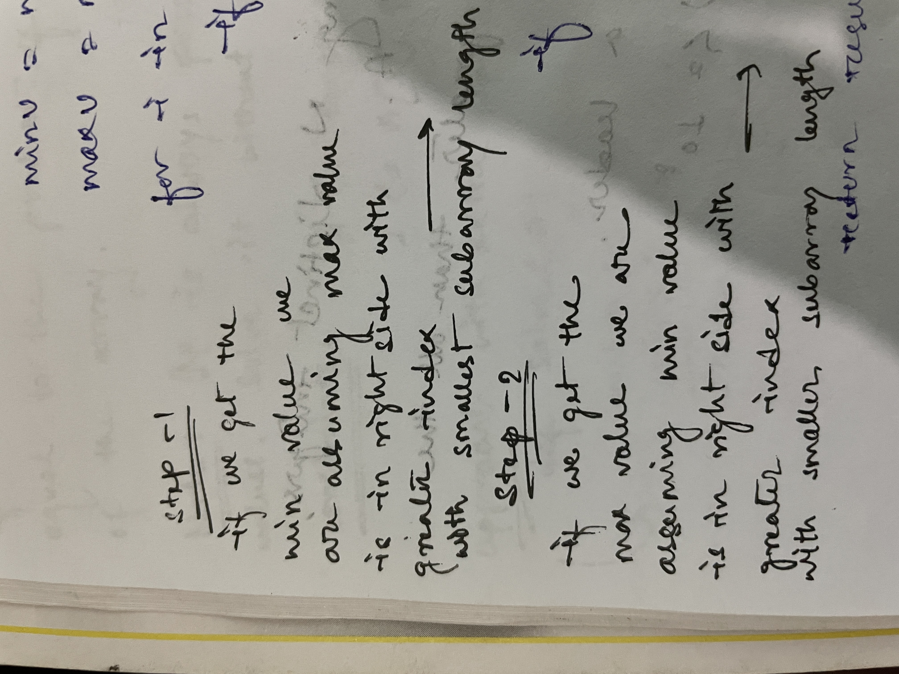

This problem can be solved in a simple O(N) complexity.
We can implement a sliding window kind of algorithm using two pointers. We can slide over the array and keep track of every last occurrence of the minimum and maximum element of the array.
In order to find the start point, we can simply remember the last occurrences of a minimum and a maximum value, respectively. And for each min-max pair, we check the length of the subarray that encloses them and then update out overall based on that.

We are implementing

    TC : O(N)
    SC : O(1)